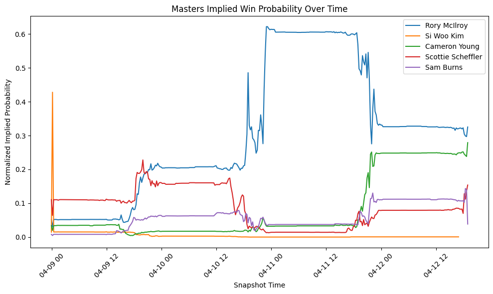
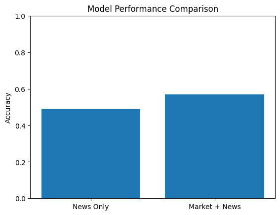

# Do News Signals Drive Betting Market Movement?

## Hook

Betting markets update constantly as new information becomes available, but how much of that movement is actually driven by news? This project investigates whether player-specific news coverage can explain changes in betting odds during the Masters Tournament.

---

## Problem Statement

Betting odds reflect market expectations about outcomes and are influenced by many factors, including player performance, injuries, and public perception. However, it is unclear whether publicly available news signals—such as article volume and sentiment—meaningfully explain short-term changes in implied win probabilities. This project focuses on predicting whether a player’s probability of winning increases in the next market snapshot using both market data and news-based features.

---

## Solution Description

To address this problem, a document-model dataset was built using MongoDB by combining sportsbook odds data from The Odds API with player-specific news articles from NewsAPI. Each document represents a player snapshot and includes features such as implied probability, recent changes in odds, article count, sentiment, and source diversity.

The analysis pipeline loads this data into a pandas DataFrame and evaluates predictive models using logistic regression. A comparison is made between a **news-only model** and a **combined model that includes both market and news features**, allowing us to directly test whether news signals provide meaningful predictive power.

---

## Chart

This chart shows how implied win probabilities for top players evolved over time during the tournament, illustrating how betting markets continuously adjust expectations.

---

## Model Performance

The chart compares the performance of the news-only model and the combined model. The news-only model performs close to random, while the combined model shows modest improvement, highlighting the importance of market-based features.

---

## Key Findings

- The **news-only model achieved approximately 49% accuracy**, which is close to random guessing  
- The **combined model (market + news) achieved approximately 56–57% accuracy**  
- News-based features such as article count and sentiment provided **limited predictive value**

---

## Conclusion

The results suggest that simple news signals do not meaningfully explain short-term betting market movement. Instead, betting markets appear to rapidly incorporate publicly available information, leaving little additional signal in basic news features. This supports the idea that betting markets are highly efficient and that predicting short-term changes in implied probabilities is inherently challenging.
